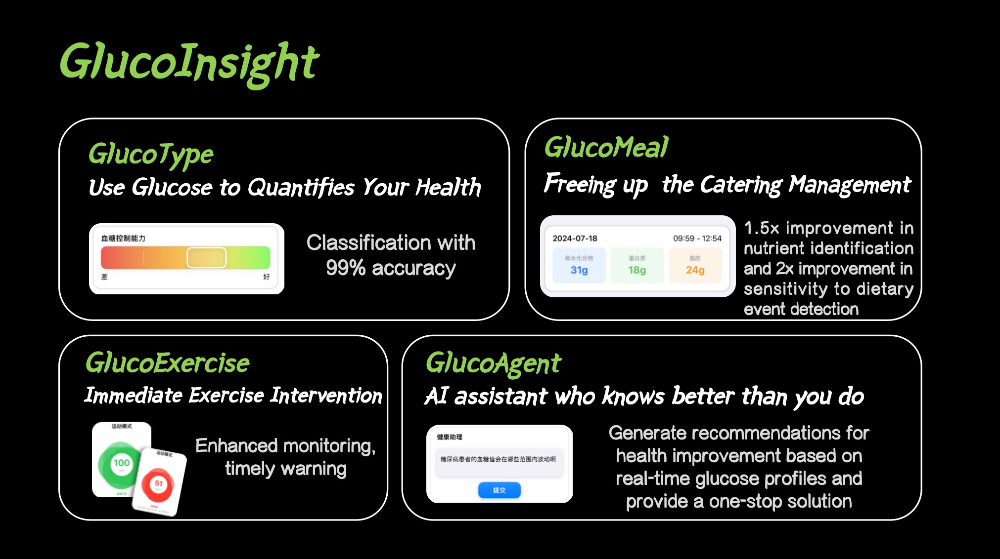
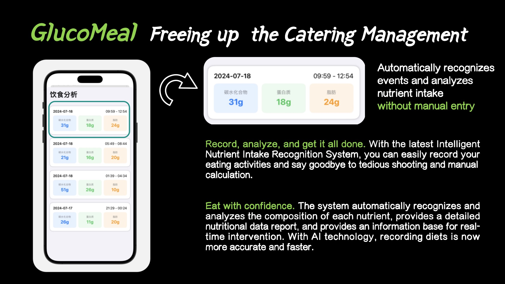

# **GlucoInsight：Smart Health Management Framework based on CGM**

**No more hand input, record your food intake automatically**

> Build in AdventureX 2024, by Hengrui Zhang, Sichao He, Rong Han, Zengyao Cheng and Yi He

> This project have won the "New workflow of AI" track champion of AdventureX 2024

> If you want to collaborate and know more about what we are doing, please cantact Hengrui at rmhizha@ucl.ac.uk

### **Do Normal People need to monitor their glucose?** 

**Glucose literally affects everyone.** 
This includes our mood, sleep, weight, skin, immune system health, risk of heart disease, and chances of conception. A previous study showed that only 12% of Americans have a healthy metabolism, which means that only 12% of Americans have perfectly functioning bodies, including having healthy blood sugar levels. **In other words, 9 out of 10 of the people closest to us may be riding the "glucose roller coaster" without even realizing it**."

**Why 'blood sugar' and not 'calories'?**
Dramatic fluctuations in blood sugar levels can lead to erratic energy levels, mood swings, increased hunger, and long-term health problems. Smooth blood sugar levels help maintain stable energy and mood, and research shows that keeping an eye on blood sugar can improve health in many ways. Quality of food is more important than quantity. High-quality foods (such as fiber-rich foods) help maintain stable blood sugar levels, rather than simply reducing calorie intake. Focusing on calories alone makes it easier to fall into dieting anxiety. 

Source: "The Glucose Revolution" by Jesse Anzospeh.

## Here are our major features implemented

### **GlucoType, the new glucose test that quantifies your health**

### **GlucoMeal 'frees' you from the tedious process of diet management** ! 

### **GlucoAgent The health assistant that knows your body better than you do** ! 

